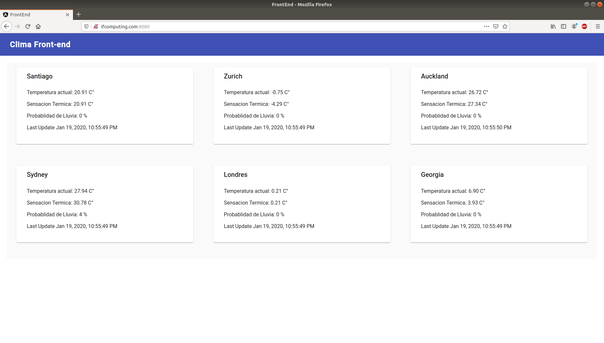

# Prueba técnica

<p float="left">
    
</p>


Aplicación desarrollada para prueba técnica.

## Instalación y uso

Se dispone de un archivo docker-compose.yml para ser instalado y ejecutado con Docker

```bash
git clone https://github.com/felipegodoycc/prueba-tecnica.git
cd prueba-tecnica
docker-compose build
docker-compose up
```
## Disponibilidad online

De igual manera, los servicios de redis, backend y frontend se encuentran disponibles en un servidor propio [click aqui](http://ifcomputing.com:8080)

Puertos servidor: 
- redis => ifcomputing.com:6379
- backend => ifcomputing.com:3050
- frontend => ifcomputing.com:8080


## License
[MIT](https://choosealicense.com/licenses/mit/)